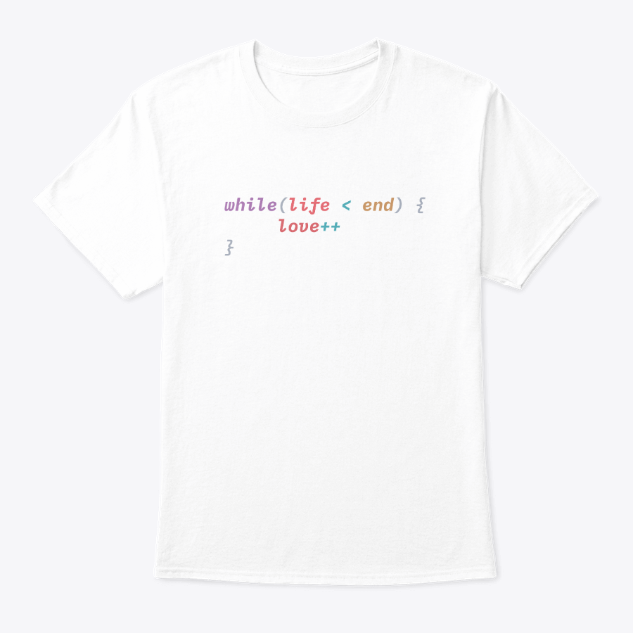
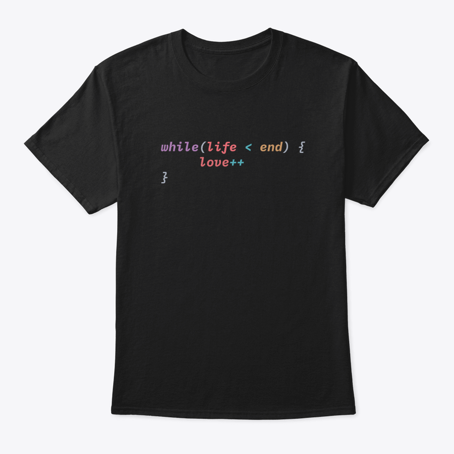
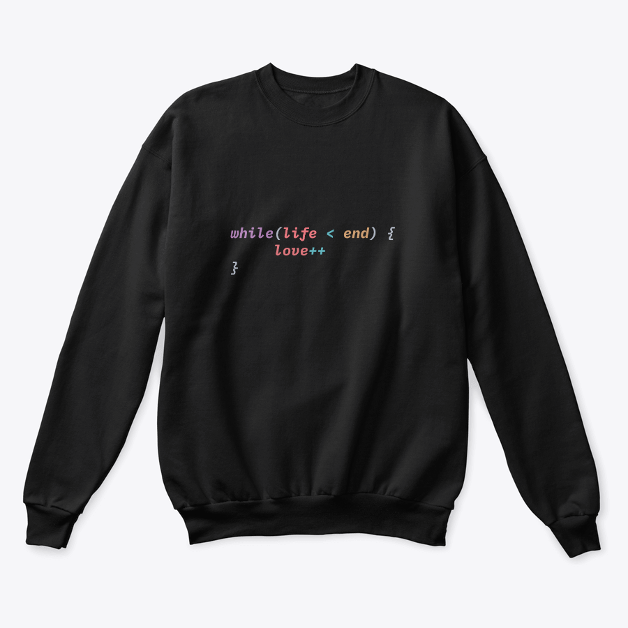
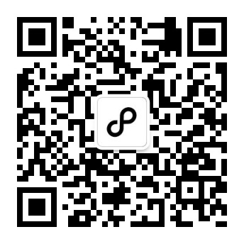

# 一封代码情诗


## Issues投稿形式

  用任意编程语言，选择以下 2 个方向之一写下不超过 50 行代码

  * **代码写情诗**
  * **代码写决绝诗**

### 示例


```
  此生爱你 只增不减 - 掘金@March21Sunny
```

以 Carbon 生成对应的代码图片，在线代码图片生成器 Carbon 传送门：[👀这里](https://carbon.now.sh)。

<br/>

## 奖项设置

每个奖项周期内，Issues获得 👍 的排名前三的小伙伴将获得相关奖品，包括 #代码情诗# 定制款T恤或贴纸。





  
### 奖项赞助

本活动所有礼品由 [壹周边](http://one-press.cn) 提供！



<br/>
  
## 活动时间

 * 第一季 20190610 - 20191111

<br/>

> 活动起源: [掘金沸点-代码写诗](https://juejin.im/topic/5b6a82c6092dcb61bd728809)
