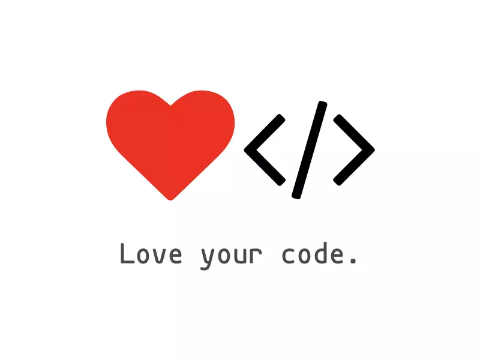
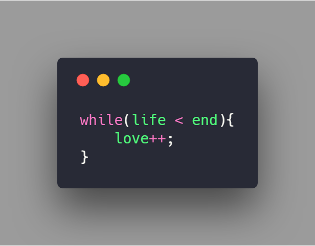

# 一封代码情诗

## Issues投稿形式

  用任意编程语言，选择以下 2 个方向之一写下不超过 50 行代码

  * **代码写情诗**
  * **代码写决绝诗**

以 Carbon 生成对应的代码图片，在线代码图片生成器 Carbon 传送门：[👀这里](https://carbon.now.sh)。

### 示例
···
  
  此生爱你 只增不减
···
  
 
 

## 奖项设置

每个奖项周期内，Issues获得 👍 的排名前三的小伙伴将获得相关奖品，包括 #代码情诗# 定制款T恤或贴纸。
  
 
  
## 活动时间

20190610 - 20191111

